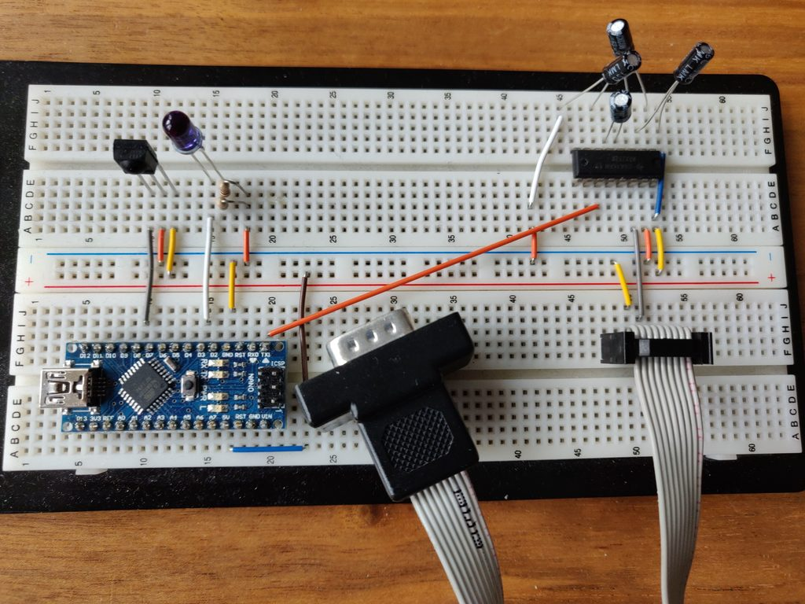
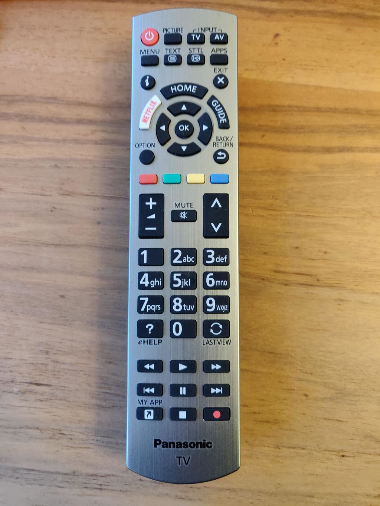

Panasonic Remote Controls a Rotel RA-12 Amp
-------------------------------------------

In my living room there is a Panasonic TV set connected
to a Rotel RA-12 amp. The speakers of the Panasonic TV
are switched off and the Rotel amp is connected with s/pdif
to the TV set.

The IR remote of the TV set cannot be programmed to the
Rotel codes, the Rotel amp cannot learn the codes of the
Panasonic remote, and s/pdif has no control channel like
HDMI-CEC.

So..

This project let you control the Rotel amp with the
Panasonic Remote. The TV set ignores the vol/mute buttons
when the internal speakers are off.

What's working:
```
  Vol+,Vol-
        Vol+ turns the amp on if it's off
  Power Off
  Mute
        Vol+ unmutes
  Green Green
        when pressing green twice a LED lights up on the Arduino nano
        and the nano goes into input select mode.
        In this mode Red, Green, Blue, Yellow switches between Rotel amp inputs.
        Input select mode stops with any other button an the remote
```
Parts neede:

* arduino nano
* IR receiver
* MAX 232 serial converter 5V/12V
* Dsub9 plug/cable
* some capacitors

The IR receiver is connected pin 8. See https://github.com/z3t0/Arduino-IRremote
for a how to.

The max232 is connected to TX of the Arduino nano, and needs some capacitors.
http://www.ti.com/lit/gpn/max232

In PanasonicIrCodes.h I collected the Panasonic remote codes.

The RS232 commands for the Rotel amp can be found at:
http://www.rotel.com/sites/default/files/product/rs232/RA12%20Protocol.pdf

I used the following commands:
```
   power_on!
   power_off!
   mute_on!
   mute_off!
   volume_up!
   volume_down!
   coax1!
   opt1!
   opt2!
   aux2!
```




